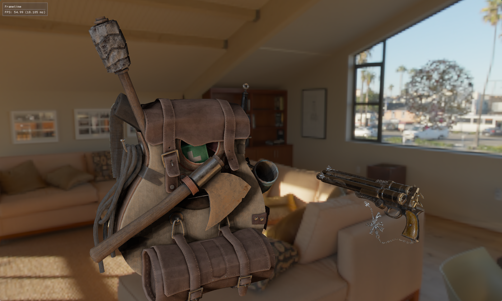

<h2 align="center">Physbuzz Engine and Library</h2>

<div align="center">
    <p><i>Give someone an engine and they'll make a game. Teach someone to make an engine and they'll never make anything.</i></p>
    </img>
  <figcaption><i>Models by Berk Gedik (left) and JuanXGL (right)</i></figcaption>

</div>

> [!NOTE]
> This library is WIP and probably will be for the forseeable future, dont use this pls the api is forever unstable ty.

Currently features:

- PBR (based on Trowbridge-Reitz's GGX).
- Frame/Render graph.
- Directional and omnidirectional shadows (with culling).
- GPU driven frustum culling
- ImGui integration.
- Forward and deferred renderers.
- Entity component system.
- Event manager.
- Asset/Resource manager.
- Hot-Reloadable resources.
- Multithreaded I/O.
- _very_ Basic 2D physics (3D WIP).
- And alot more planned!

# Building

The following libraries are needed for linking:

- [GLM](https://github.com/g-truc/glm/)
- [assimp](https://github.com/assimp/assimp/)
- [GLFW3](https://github.com/glfw/glfw)
- [spdlog](https://github.com/gabime/spdlog)
- [Vulkan](https://www.vulkan.org/tools)
- [Shader Slang](https://github.com/shader-slang/slang)
- [OpenEXR](https://github.com/AcademySoftwareFoundation/openexr)

And optionally,

- [Catch2](https://github.com/catchorg/Catch2) (testing only)

1. Clone the repository

```sh
# due to git lfs this might take a while.
git clone --recurse-submodules https://github.com/Abaan404/physbuzz
```

2. Build with cmake.

```sh
cmake -DCMAKE_BUILD_TYPE=Release -S . -B ./build
cmake --build ./build --target game --config Release
```

3. Run the binary

```sh
./build/Release/physbuzz # or ./build/physbuzz
```

Or equivalent with your IDEs cmake build tools.

# References and Acknowledgements

- [LeanOpenGL](https://learnopengl.com/) and [How To Vulkan](https://howtovulkan.com/) for a really nice basic introduction to rendering techniques and APIs.
- [The Cherno's](https://www.youtube.com/@TheCherno) c++ and opengl series.
- my sanity.

_PBR stuff:_
- R. L. Cook and K. E. Torrance. 1982. A Reflectance Model for Computer Graphics. ACM Trans. Graph. 1, 1 (Jan. 1982), 7–24. https://doi.org/10.1145/357290.357293
- Bruce Walter, Stephen R. Marschner, Hongsong Li, and Kenneth E. Torrance. 2007. Microfacet models for refraction through rough surfaces. In Proceedings of the 18th Eurographics conference on Rendering Techniques (EGSR'07). Eurographics Association, Goslar, DEU, 195–206.
- Schlick, C. (1994), An Inexpensive BRDF Model for Physically-based Rendering. Computer Graphics Forum, 13: 233-246. https://doi.org/10.1111/1467-8659.1330233
- Sawicki, D. (2021). Microfacet Distribution Function: To Change or Not to Change, That Is the Question. https://doi.org/10.5220/0010252702090220
